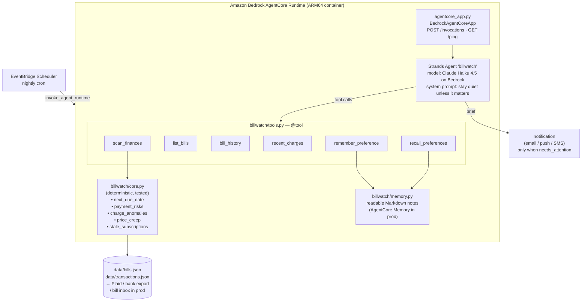

# BillWatch — Architecture

## Overview

BillWatch is a **single Strands agent** with a hard rule: never do money
arithmetic itself. All numeric judgement is in a deterministic Python core; the
agent decides which findings are worth a human's attention and says them
briefly.

## Components

| File | Responsibility |
|---|---|
| `agentcore_app.py` | AgentCore Runtime contract. `@app.entrypoint` takes `{prompt, actor_id}`, returns `{result}`. |
| `billwatch/agent.py` | `build_agent()` / `run_agent()`. System prompt enforces restraint and "tools are ground truth". |
| `billwatch/tools.py` | Six `@tool` functions. Thin — no logic, they call `core` and `memory`. |
| `billwatch/core.py` | **The correctness layer.** Every threshold and formula. Pure functions over dicts. |
| `billwatch/memory.py` | Durable preferences as one-line Markdown facts, namespaced by `actor_id`. |
| `billwatch/config.py` | Model id (`MODEL_ID` env override), region, data paths. |
| `tests/test_core.py` | 9 deterministic tests. No model, no network. |
| `run_demo.py` | Runs `core.scan()` and prints the findings — proves the system with zero Bedrock calls. |

## How it meets the three hackathon requirements

| Requirement | Where |
|---|---|
| **Built with Strands Agents SDK** | `billwatch/agent.py` — `strands.Agent` + `@tool` from `strands`. |
| **Handles routine/repetitive work in the background** | The weekly "did any bill sneak up, did any charge look wrong, is any subscription dead weight" sweep, run on an EventBridge cron, silent unless action is needed. |
| **Deployable on Amazon Bedrock AgentCore** | `agentcore_app.py` implements the Runtime contract via `BedrockAgentCoreApp`; `DEPLOY.md` has the `configure` / `deploy` / `invoke` steps. |

## Model

Default `us.anthropic.claude-haiku-4-5-20251001-v1:0` (cross-region inference
profile, on by default for new accounts in us-east-1). Override with `MODEL_ID`.
Temperature 0.2 — this is a judgement task, not a creative one.

## Production swap-ins

- `core.load_bills` / `core.load_transactions` → Plaid, a bank CSV export, or a
  parser over a dedicated bill inbox (the same vision-extraction approach used in
  the author's `bills_scan` tool for receipt photos).
- `memory.py` → AgentCore Memory (enable with `agentcore configure`).
- output → SES email / SNS / a push provider, sent only when `needs_attention`.
